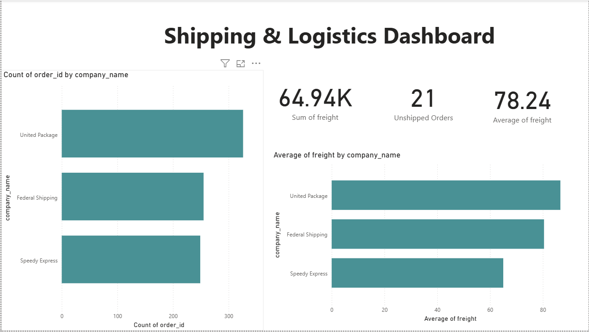
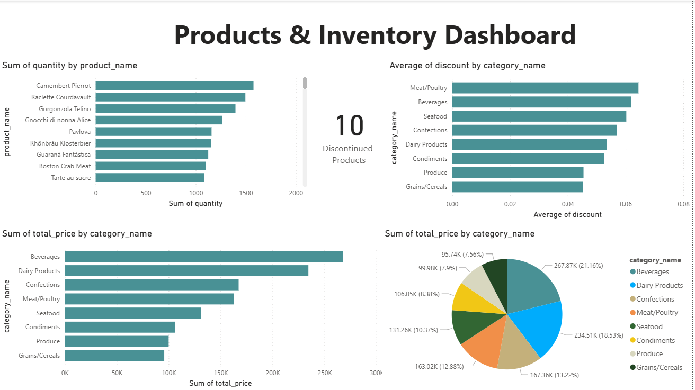

# Northwind Data Warehouse Project

A complete, hands-on Data Engineering project: building a PostgreSQL-based Data Warehouse for the Northwind trading company, from raw transactional data to analytical dashboards.

This project was built end-to-end by me as a learning exercise, following the full standard Data Engineering workflow: **Data Profiling → Dimensional Modeling → ETL (manual SQL and dbt) → Automated Testing → BI Dashboards**.

---

## Project Overview

Northwind is a classic sample OLTP database representing a food import/export company (customers, orders, products, employees, suppliers, shippers). The goal of this project was to transform this transactional data into a proper analytical **Star Schema** Data Warehouse, and then build BI dashboards on top of it — while practicing every step a real Data Engineer would go through.

**Tech stack:** PostgreSQL 18 · pgAdmin 4 · dbt-postgres · Power BI Desktop · Mermaid (ERD)

---

## 1. Data Profiling

Before any modeling, I profiled the source `northwind` database to understand its structure and quality:

- **Structure profiling** — inspected every table's columns, data types, and nullability via `information_schema.columns`.
- **Content profiling** — checked NULLs in key business columns (`orders.customer_id`, `employee_id`, `order_date`), and value ranges (`discount` 0–0.25, `unit_price` 2–263.5, `quantity` 1–130).
- **Referential integrity** — verified via `LEFT JOIN` + `IS NULL` checks that there were **zero orphan records** across `order_details` ↔ `orders`, `orders` ↔ `customers`, `products` ↔ `suppliers`.
- **Result:** the source data was clean — no data cleansing was required before modeling, which let the project focus on the modeling/ETL/BI workflow itself.

Key numbers found: 91 customers, 830 orders, 2155 order lines, 77 products, 9 employees, 21 unshipped orders, 10 discontinued products.

---

## 2. Dimensional Modeling

### Business process
The chosen business process is **Sales** — a customer places an order, an employee records it, products are sold, and the order is shipped.

### Grain decision
The fact grain is **one row per product per order** (order-line level) — the most granular level available in the source, so nothing gets lost that could later be needed (aggregation up is always possible; disaggregation is not).

### Handling `freight` (a modeling decision)
`freight` in the source lives at the **order** level, not the product-line level. Rather than duplicating or arbitrarily splitting it across order lines (which invites additive errors), I split it into a **separate fact table** at order grain: `order_fact`.

### Final Star Schema
- `customer_dim`, `employee_dim` (with self-referencing `reports_to` hierarchy), `product_dim` (flattened with category & supplier names), `date_dim` (a role-playing dimension, generated via `generate_series` since Northwind has no native calendar table), `shipper_dim`
- `sales_fact` — grain: product × order
- `order_fact` — grain: order (holds `freight`, and 3 role-playing dates: order/required/shipped)

See `docs/erd.md` for the full Mermaid ERD diagram.

---

## 3. ETL — Manual SQL (first pass)

To deeply understand the transformation logic before automating it, I first built the entire pipeline in raw SQL:

1. Connected the `northwind` (source) and `northwind_dwh` (destination) databases using **`postgres_fdw`** (Foreign Data Wrapper) — the standard, production-grade way to query across Postgres databases.
2. Used `IMPORT FOREIGN SCHEMA` to expose source tables inside `northwind_dwh` under a `source_data` schema.
3. Populated each dimension with `INSERT INTO ... SELECT`, translating natural keys to surrogate keys.
4. Handled the `employee_dim.reports_to` self-reference with a follow-up `UPDATE` (self-join mapping `employee_id` → `emp_sk`) once all surrogate keys existed.
5. Populated `sales_fact` and `order_fact` with `JOIN`/`LEFT JOIN` against all dimensions — `LEFT JOIN` specifically for `order_fact` dates, since ~21 orders have no `shipped_date` yet.

All row counts were verified against the source at every step (e.g., `sales_fact` = 2155 rows, matching `order_details` exactly — zero data loss).

SQL scripts: see `sql/` folder.

---

## 4. ETL — dbt (production-style rebuild)

After validating the logic manually, I rebuilt the entire pipeline using **dbt** — the industry-standard transformation tool — to practice a more maintainable, testable approach:

- Declared source tables in `sources.yml`.
- Rebuilt each dimension and fact as a dbt **model** (`.sql` files using `{{ source(...) }}` and `{{ ref(...) }}`), letting dbt auto-resolve the build order via its dependency graph instead of manually sequencing scripts.
- Configured all models to materialize as physical **tables** (not the default views) via `dbt_project.yml`, matching DWH best practice for a Gold-layer analytical schema.
- Added surrogate keys with `ROW_NUMBER()` inside each dimension model (an early bug — missing surrogate keys — surfaced and got fixed here).
- Handled `date_dim` as a **role-playing dimension** in `order_fact`, joining it three times with different aliases for order/required/shipped dates.

Result: `dbt run` builds and populates the entire warehouse (all 7 models) in one command, with counts identical to the manual SQL version.

dbt project: see `dbt/` folder.

---

## 5. Automated Data Quality Tests (dbt tests)

To replace the manual profiling checks with something repeatable, I added dbt schema tests (`models/schema.yml`):

- `not_null` / `unique` on all surrogate keys and natural keys
- `relationships` tests re-checking the exact referential-integrity constraints found manually during profiling (e.g., every `sales_fact.cust_sk` must exist in `customer_dim`)

**Result: 13/13 tests passing.** These can be re-run any time (`dbt test`) to catch data quality regressions automatically.

---

## 6. Power BI Dashboards

Connected Power BI Desktop directly to `northwind_dwh` via PostgreSQL connector, loaded all 7 tables, and manually configured the `date_dim` relationships (Power BI's auto-detection didn't catch the date joins).

Built two dashboards from scratch:

- **Shipping & Logistics Dashboard** — total freight, average freight by shipper, order count by shipper, unshipped orders (via a custom DAX measure).

  

- **Products & Inventory Dashboard** — top products by quantity sold, sales by category (bar + pie), discontinued product count, average discount by category.

  

---

## Project Structure

```
├── src-database/          # Original Northwind OLTP schema + data (DDL/DML)
├── sql/                   # Manual SQL ETL scripts (DDL for DWH + population scripts)
├── dbt/                   # dbt project (models, schema tests, config)
├── docs/
│   ├── erd.md              # Mermaid ERD of the star schema
│   └── dashboards/          # Power BI dashboard screenshots
└── README.md
```

---

## What I practiced in this project

- Writing and interpreting data profiling SQL (NULL checks, orphan/referential-integrity checks, value-range checks)
- Dimensional modeling decisions: grain selection, fact/dimension separation, role-playing dimensions, surrogate keys
- Cross-database querying with `postgres_fdw`
- Building an ETL pipeline manually in SQL, then re-implementing it in dbt
- Writing dbt models with `source()`/`ref()` and letting dbt manage build order
- Writing automated dbt data-quality tests
- Connecting and modeling a Power BI semantic layer, and building dashboards with DAX measures
