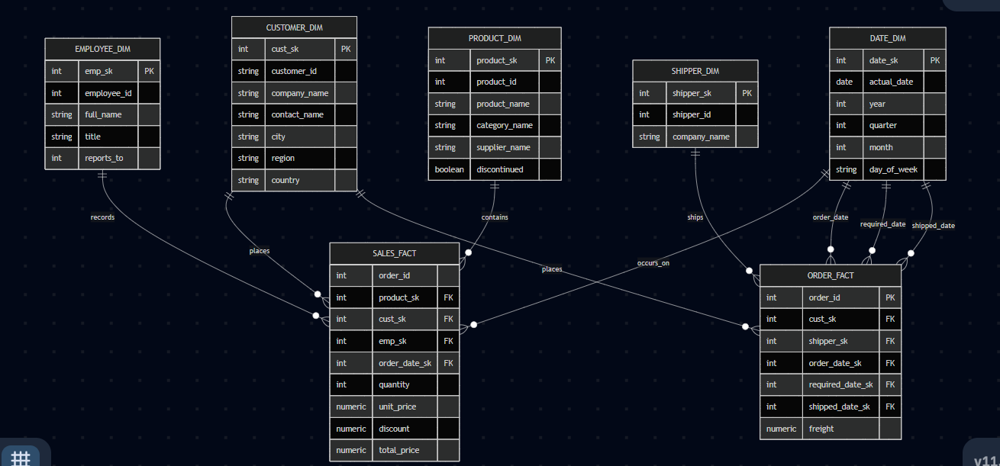

# 🏢 Northwind Data Warehouse

[](https://www.postgresql.org/)
[](https://www.getdbt.com/)
[](https://powerbi.microsoft.com/)
[]()

A complete, hands-on Data Engineering project: transforming the Northwind OLTP database into a production-style analytical Data Warehouse — from raw data profiling to BI dashboards.

Built end-to-end following the standard Data Engineering workflow:

**Data Profiling → Dimensional Modeling → ETL (SQL + dbt) → Automated Testing → BI Dashboards**

---

## 📊 Dashboards

| Shipping & Logistics | Products & Inventory |
|:---:|:---:|
|  |  |

## 🗺️ Star Schema



---

## Project Overview

Northwind is a classic sample OLTP database representing a food import/export company (customers, orders, products, employees, suppliers, shippers). The goal was to transform this transactional data into a proper analytical **Star Schema** Data Warehouse, then build BI dashboards on top of it.

**Tech stack:** PostgreSQL 18 · pgAdmin 4 · dbt-postgres · Power BI Desktop · Mermaid (ERD)

---

## 1️⃣ Data Profiling

Before any modeling, I profiled the source `northwind` database to understand its structure and quality:

- **Structure profiling** — inspected every table's columns, data types, and nullability via `information_schema.columns`.
- **Content profiling** — checked NULLs in key business columns (`orders.customer_id`, `employee_id`, `order_date`), and value ranges (`discount` 0–0.25, `unit_price` 2–263.5, `quantity` 1–130).
- **Referential integrity** — verified via `LEFT JOIN` + `IS NULL` checks that there were **zero orphan records** across `order_details` ↔ `orders`, `orders` ↔ `customers`, `products` ↔ `suppliers`.
- **Result:** the source data was clean — no cleansing was required before modeling.

Key numbers found: 91 customers, 830 orders, 2155 order lines, 77 products, 9 employees, 21 unshipped orders, 10 discontinued products.

---

## 2️⃣ Dimensional Modeling

**Business process:** Sales — a customer places an order, an employee records it, products are sold, and the order is shipped.

**Grain decision:** one row per product per order (order-line level) — the most granular level available in the source.

**Handling `freight` (a modeling decision):** `freight` in the source lives at the order level, not the product-line level. Rather than duplicating or arbitrarily splitting it across order lines (which invites additive errors), I split it into a **separate fact table** at order grain: `order_fact`.

**Final Star Schema:**
- `customer_dim`, `employee_dim` (self-referencing `reports_to` hierarchy), `product_dim` (flattened category/supplier), `date_dim` (role-playing, generated via `generate_series`), `shipper_dim`
- `sales_fact` — grain: product × order
- `order_fact` — grain: order (holds `freight` + 3 role-playing dates)

Full diagram: [`docs/erd.md`](docs/erd.md)

---

## 3️⃣ ETL — Manual SQL (first pass)

To deeply understand the transformation logic before automating it:

1. Connected `northwind` (source) and `northwind_dwh` (destination) using **`postgres_fdw`** — the standard cross-database approach in Postgres.
2. Used `IMPORT FOREIGN SCHEMA` to expose source tables under a `source_data` schema.
3. Populated each dimension with `INSERT INTO ... SELECT`, translating natural keys to surrogate keys.
4. Handled `employee_dim.reports_to` with a follow-up self-join `UPDATE` once all surrogate keys existed.
5. Populated `sales_fact` / `order_fact` with `JOIN`/`LEFT JOIN` — `LEFT JOIN` specifically for dates, since ~21 orders have no `shipped_date` yet.

All row counts verified against source at every step. Scripts: [`sql/`](sql/)

---

## 4️⃣ ETL — dbt (production-style rebuild)

Rebuilt the entire pipeline using **dbt** to practice a maintainable, testable approach:

- Declared sources in `sources.yml`.
- Rebuilt each dimension/fact as a dbt model using `{{ source(...) }}` / `{{ ref(...) }}`, letting dbt auto-resolve build order via its dependency graph.
- Configured all models to materialize as physical **tables** (matching DWH best practice for a Gold layer).
- Added surrogate keys via `ROW_NUMBER()`.
- Modeled `date_dim` as a **role-playing dimension** in `order_fact` (3 aliased joins for order/required/shipped dates).

`dbt run` builds and populates the entire warehouse in one command. Project: [`northwind_dwh_dbt/`](northwind_dwh_dbt/)

---

## 5️⃣ Automated Data Quality Tests

Replaced manual profiling checks with repeatable dbt schema tests: `not_null`, `unique`, and `relationships` tests re-checking referential integrity found during profiling.

**Result: 13/13 tests passing** ✅ — re-runnable any time via `dbt test`.

---

## 6️⃣ Power BI Dashboards

Connected Power BI Desktop directly to `northwind_dwh`, loaded all 7 tables, and configured relationships (including manually linking the role-playing `date_dim`).

- **Shipping & Logistics Dashboard** — total freight, avg freight by shipper, order count by shipper, unshipped orders (via DAX measure).
- **Products & Inventory Dashboard** — top products by quantity, sales by category (bar + pie), discontinued products, avg discount by category.

---

## 📁 Project Structure

```
├── src-database/          # Original Northwind OLTP schema + data
├── sql/                   # Manual SQL ETL scripts
├── northwind_dwh_dbt/     # dbt project (models, schema tests, config)
├── docs/
│   ├── erd.md               # Mermaid ERD + design decisions
│   ├── erd_diagram.png
│   └── dashboards/           # Power BI dashboard screenshots
└── README.md
```

---

## 🎯 Skills Practiced

- Data profiling: NULL checks, orphan/referential-integrity checks, value-range checks
- Dimensional modeling: grain selection, fact/dimension separation, role-playing dimensions, surrogate keys
- Cross-database querying with `postgres_fdw`
- ETL pipeline design: manual SQL, then re-implemented in dbt
- dbt models with `source()`/`ref()` and dependency-graph-managed builds
- Automated data-quality testing with dbt
- Power BI semantic modeling and DAX measures
