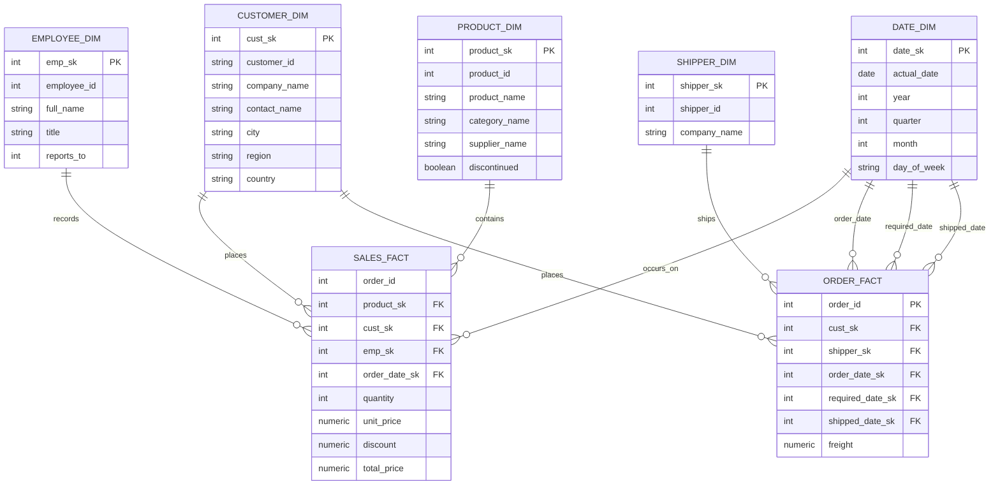

# Star Schema — Entity Relationship Diagram

Designed after data profiling confirmed the source data was clean. Grain: `sales_fact` = one row per product per order; `order_fact` = one row per order (freight kept separate to avoid additive errors when aggregating).

## Design decisions

- **`date_dim` is a role-playing dimension**: joined once for `sales_fact.order_date_sk`, and three times (order/required/shipped) for `order_fact`.
- **`product_dim` excludes `unit_price`**: the current catalog price would conflict with the historical transaction price already stored in `sales_fact.unit_price`. Keeping only one avoids ambiguity about which price is "correct."
- **`employee_dim.reports_to` is self-referencing**: points to another row's `emp_sk` in the same table, populated via a self-join after all surrogate keys exist.
